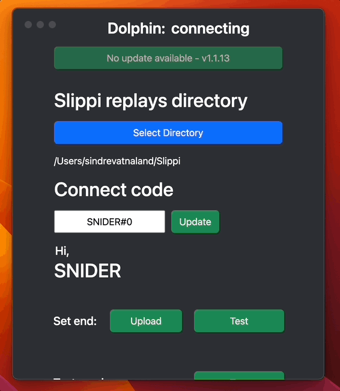

  

# Slippi Stats Display

## Download

[Download](https://github.com/slprank/slpRank-app/releases/tag/v1.1.251)

[Other releases](https://github.com/slprank/slpRank-app/releases)

## Demo

[Twitter video](https://twitter.com/SniderSSBM/status/1617592751423373312)

  

## Features

- Both players rank stats during set
- Rank up/down animation post set
- Keep track of players scores in ranked and friendlies
- Keep track of current session win, loss and rating change
- Post game stats
- Automatic scene switching between games with OBS
- Sound effects on set end, win and loss
- Customizable background, text, win and lose color
- Customizable sound effects
- Overlay `Test` button to simulate a game. Also triggers OBS transitions
